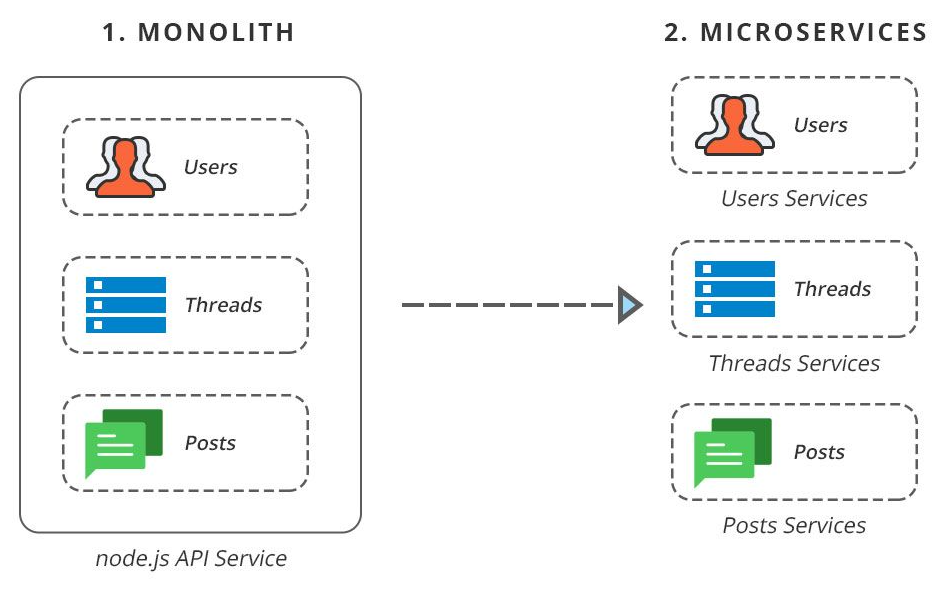

# Header 1 

## Header 2

### Header 3

#### Header 4

##### Header 5

###### Header 6

---

*Italic*

**Bold**

~~Mistaken~~

==Highlight==

---

> Blockquote
>
> > Nested Blockquote

---

* Java
* JavaScript
* Python
* C++

1. Data Structure
2. Operating System
3. Computer Network
4. Principles of computer composition

---

- [x] Learning microservices

- [ ] Develop tracer
- [x] Keep fit
- [ ] Playing DotA2

---

So far many programmers like using `Java` to build microservices project. A lot of microservices related libs are presented in Java Community, such as `Eureka`, `Feign`, `Ribbon` and so on.

---

~~~java
public class SomeClass<T extends Runnable> {
    protected T field = null;
    private final String greet = "Hello World!";

    /**
     * This is a main method.
     * @param args arguments.
     * @return zero
     */
    public static int main(String[] args) {
        System.out.println(new SomeClass<>().greet);
        System.out.println(new SomeClass<>().getGreet());
        return 0;
    }

    public String getGreet() {
        return this.greet;
    }
}
~~~

~~~bash
git pull --force
~~~

~~~python
def solve(arr: list, l: int, r: int) -> int:
    # Conquer
    if l == r:
        return arr[l]

    # Divide
    mid = (l + r) >> 1  # middle index
    left_solution = solve(arr, 0, mid)
    right_solution = solve(arr, mid + 1, r)

    # Combine
    # a probability that the sub-array go across division
    # [left]
    left_sum = left_max_sum = arr[mid]
    for i in range(mid - 1, l, -1):
        left_sum += arr[i]
        if left_sum > left_max_sum:
            left_max_sum = left_sum
    # [right]
    right_sum = right_max_sum = arr[mid + 1]
    for i in range(mid + 2, r):
        right_sum += arr[i]
        if right_sum > right_max_sum:
            right_max_sum = right_sum

    return max(left_solution, right_solution, left_max_sum + right_max_sum)
~~~

---

| #    | item name                | price |
| ---- | ------------------------ | ----- |
| 1    | pen                      | $6.5  |
| 2    | Rubik's cube             | $26   |
| 3    | *Principle of compiling* | $68.8 |
| 4    | Pokemon toy              | $14.8 |

---

To learn more about the author who develop this theme, check out his [github profile](https://github.com/shotgun8767).

---

The following image show how microservices work.

---

$$ \mathbf{V}_1 \times \mathbf{V}_2 =  \begin{vmatrix} \mathbf{i} & \mathbf{j} & \mathbf{k} \\ \frac{\partial X}{\partial u} &  \frac{\partial Y}{\partial u} & 0 \\ \frac{\partial X}{\partial v} &  \frac{\partial Y}{\partial v} & 0 \\ \end{vmatrix} $$

---

